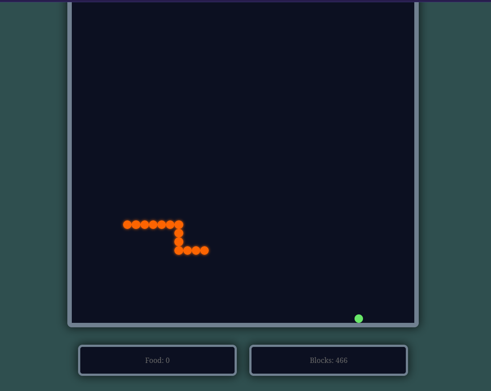

# Nokia Snake Game

Developed a classic Nokia Snake game as a web-based application, recreating the original gameplay experience with smooth controls, score tracking, and responsive design using modern web technologies

## Usage:
Use the keyboard arrow keys to control the snake’s movement

## Note:
Best result on Google Chrome (Desktop)

## License

This project is licensed under the MIT license. See the [LICENSE](./LICENSE) file for more info

